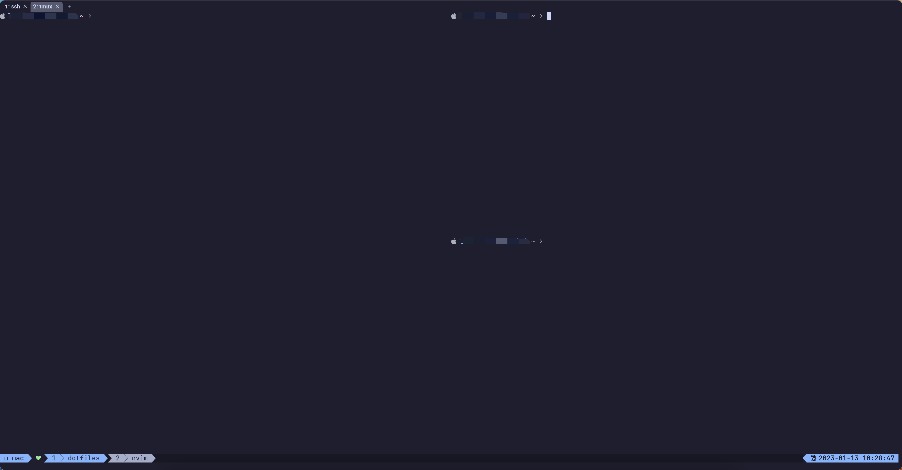

## Catppuccin Mocha color theme configuration for Tmux

This theme is inspired by tmux-gruvbox while using catppcuin mocha for color matching.

### Screenshot

*Screenshots made from macOS wezterm with catppuccin mocha theme and  JetBrainsMono Nerd Font*



### Install through [Tmux Plugin Manager](https://github.com/tmux-plugins/tpm)

Add plugin to the list of TPM plugins in `.tmux.conf`.

```
set -g @plugin 'lkzz/tmux-catppuccin'
```

Hit `prefix + I` to fetch the plugin and source it. Your Tmux should be updated with the theme at this point.

### License

GPLv3
